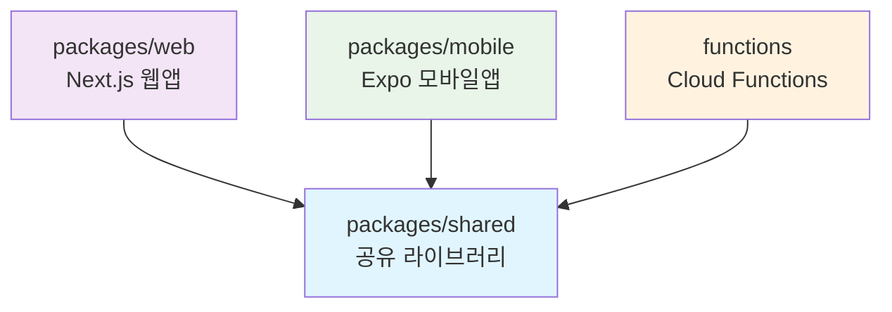

# SMIS Mentor

멘토링 매칭 및 관리를 위한 종합 플랫폼입니다. 웹, 모바일, 서버리스 함수로 구성된 모노레포 구조로 개발되었습니다.

## 📁 프로젝트 구조

```
smis-mentor/
├── packages/
│   ├── web/          # Next.js 웹 애플리케이션
│   ├── mobile/       # Expo React Native 모바일 앱
│   └── shared/       # 공유 라이브러리 (타입, 유틸리티, 서비스)
├── functions/        # Firebase Cloud Functions
└── README.md
```

## 🚀 빠른 시작

### 1. 저장소 클론 및 의존성 설치

```bash
git clone <repository-url>
cd smis-mentor
npm install
```

### 2. 환경 설정

각 패키지에서 필요한 환경 변수를 설정합니다:

- `packages/web/.env.local` - 웹 애플리케이션 환경 변수
- `packages/mobile/.env` - 모바일 앱 환경 변수  
- `functions/.env` - Firebase Functions 환경 변수

### 3. 공유 패키지 빌드

```bash
npm run dev:setup
```

### 4. 개발 서버 실행

**웹 애플리케이션:**
```bash
npm run dev:web
```
- 브라우저에서 http://localhost:3000 접속

**모바일 애플리케이션:**
```bash  
npm run start:mobile
```
- Expo 앱으로 QR 코드 스캔

**Firebase Functions:**
```bash
npm run dev:functions  
```
- Functions 에뮬레이터 실행

## 🛠️ 개발 스크립트

| 스크립트 | 설명 |
|---------|------|
| `npm run dev:setup` | 공유 패키지 빌드 (최초 실행 시 필요) |
| `npm run dev:web` | 웹 개발 서버 시작 |
| `npm run start:mobile` | 모바일 개발 서버 시작 |
| `npm run dev:functions` | Functions 에뮬레이터 시작 |
| `npm run build:all` | 모든 패키지 빌드 |
| `npm run lint` | 모든 패키지 린트 실행 |
| `npm run type-check` | TypeScript 타입 체크 |

## 🏗️ 패키지별 상세 정보

### packages/web (Next.js 웹 앱)
- **기술 스택**: Next.js 16, React 19, TypeScript
- **주요 기능**: 관리자 대시보드, 사용자 관리, 평가 시스템
- **포트**: 3000

### packages/mobile (Expo 모바일 앱)  
- **기술 스택**: Expo, React Native, TypeScript
- **주요 기능**: 멘토/멘티 매칭, 캠프 관리, 평가 입력
- **빌드**: EAS Build 사용

### packages/shared (공유 라이브러리)
- **역할**: 공통 타입 정의, 유틸리티 함수, 서비스 로직
- **빌드**: TypeScript 컴파일하여 `dist/` 생성

### functions (Firebase Cloud Functions)
- **기술 스택**: Node.js, TypeScript
- **주요 기능**: 서버리스 API, 데이터 처리, 알림 발송
- **배포**: Firebase CLI 사용

## 🏗️ 모노레포 아키텍처 규칙

### 📂 의존성 방향 (중요!)



### ✅ 허용되는 패턴
- `packages/web` → `packages/shared` ✅
- `packages/mobile` → `packages/shared` ✅  
- `functions` → `packages/shared` ✅

### ❌ 금지되는 패턴
- `packages/shared` → `packages/web` ❌
- `packages/shared` → `packages/mobile` ❌
- `packages/web` ↔ `packages/mobile` ❌

### 🔧 검증 도구

```bash
# 모노레포 아키텍처 규칙 검증
npm run validate:monorepo

# 전체 품질 검사
npm run lint && npm run type-check && npm run validate:monorepo
```

자세한 규칙은 [`.cursor/rules/monorepo-architecture.md`](.cursor/rules/monorepo-architecture.md)를 참고하세요.

## Firebase Storage 설정

이 프로젝트는 Firebase Storage를 사용하여 프로필 이미지와 파일을 관리합니다.

### 빠른 시작

```bash
# Firebase 설정 확인
npm run check-firebase

# Storage Rules 배포
npm run deploy:storage

# CORS 설정 (Google Cloud SDK 필요)
gsutil cors set cors.json gs://smis-mentor.firebasestorage.app
```

### 상세 가이드

- **빠른 해결**: [QUICK_FIX.md](./QUICK_FIX.md) - Firebase Console에서 즉시 해결하는 방법
- **상세 설정**: [FIREBASE_SETUP.md](./FIREBASE_SETUP.md) - 전체 설정 프로세스

### 주요 파일

- `serviceAccountKey.json` - Firebase Admin SDK 인증 키 (Git에 커밋되지 않음)
- `storage.rules` - Firebase Storage 보안 규칙
- `cors.json` - CORS 설정
- `check-firebase-setup.js` - 설정 확인 스크립트

## 네이버 클라우드 플랫폼 SMS API 설정

이 프로젝트는 네이버 클라우드 플랫폼의 SMS API를 사용하여 문자 메시지를 발송합니다. 
서비스를 이용하기 위해서는 다음과 같은 설정이 필요합니다:

1. [네이버 클라우드 플랫폼](https://www.ncloud.com)에서 계정 생성 및 로그인
2. 콘솔에서 Simple & Easy Notification Service(SENS) 서비스 활성화
3. 프로젝트 생성 및 SMS 서비스 설정
4. 아래 환경 변수를 `.env.local` 파일에 추가:

```bash
# 네이버 클라우드 플랫폼 SMS API
NAVER_CLOUD_SMS_SERVICE_ID="ncp:sms:kr:xxxxxxxxx:xxxx"  # 서비스 ID
NAVER_CLOUD_SMS_ACCESS_KEY="xxxxxxxxxxxxxxxxxxxx"       # 액세스 키
NAVER_CLOUD_SMS_SECRET_KEY="xxxxxxxxxxxxxxxxxxxx"       # 시크릿 키
```

자세한 설정 방법은 [네이버 클라우드 플랫폼 API 가이드](https://api.ncloud-docs.com/docs/ai-application-service-sens-smsv2)를 참고하세요.

## SMS 템플릿 관리

SMS 템플릿은 Firebase Firestore의 `smsTemplates` 컬렉션에 저장됩니다.
관리자 패널에서 템플릿을 추가, 수정, 삭제할 수 있습니다.

템플릿에서는 다음과 같은 변수를 사용할 수 있습니다:
- `{이름}`: 수신자 이름
- `{휴대폰번호}`: 수신자 휴대폰 번호
- `{이메일}`: 수신자 이메일
- `{면접일자}`: 면접 날짜 (yyyy년 MM월 dd일 형식)
- `{면접시간}`: 면접 시간 (HH:mm 형식)
- `{채용공고명}`: 채용 공고 제목

## Learn More

To learn more about Next.js, take a look at the following resources:

- [Next.js Documentation](https://nextjs.org/docs) - learn about Next.js features and API.
- [Learn Next.js](https://nextjs.org/learn) - an interactive Next.js tutorial.

You can check out [the Next.js GitHub repository](https://github.com/vercel/next.js) - your feedback and contributions are welcome!

## Deploy on Vercel

The easiest way to deploy your Next.js app is to use the [Vercel Platform](https://vercel.com/new?utm_medium=default-template&filter=next.js&utm_source=create-next-app&utm_campaign=create-next-app-readme) from the creators of Next.js.

Check out our [Next.js deployment documentation](https://nextjs.org/docs/app/building-your-application/deploying) for more details.
